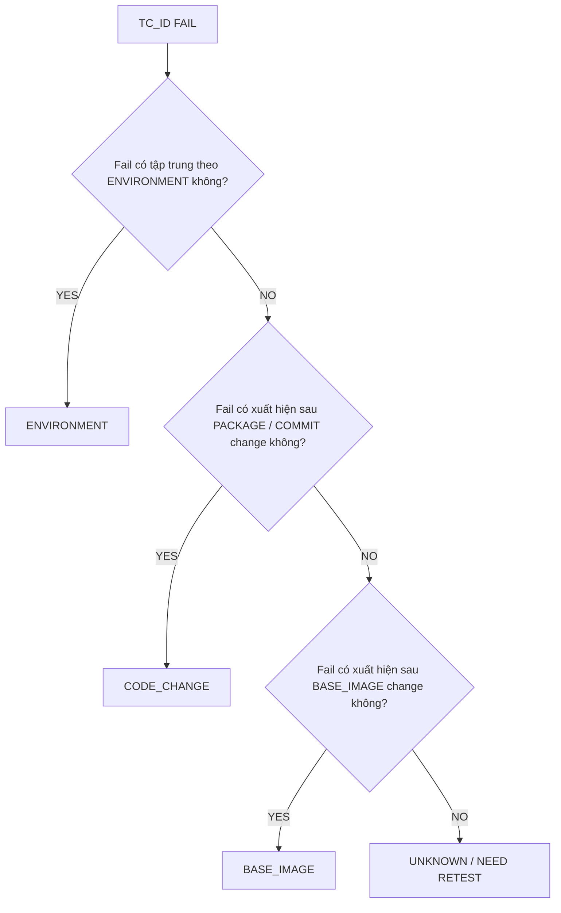
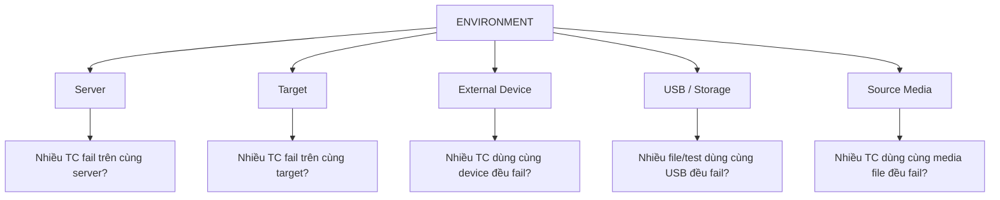
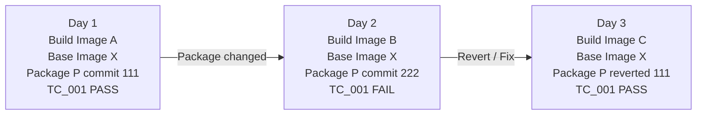

# RCA Test Fail Analyzer - Overview v0.2

> Tài liệu này tổng hợp lại hướng phân tích hiện tại của dự án **RCA Test Fail Analyzer**.  
> Mục tiêu là xây dựng một hệ thống RCA hỗ trợ điều tra nguyên nhân testcase fail dựa trên lịch sử execution, evidence và rule engine.

---

## 1. Mục tiêu hệ thống

Hệ thống cần xác định nguyên nhân có khả năng cao nhất khi một `tc_id` bị FAIL trong vòng đời build/test.

Kết quả RCA cần trả về:

- Root cause category
- Root cause subtype nếu có
- Confidence score
- Supporting evidence
- Recommended next action
- Retest strategy nếu evidence chưa đủ mạnh

---

## 2. Nguyên tắc thiết kế

Các nguyên tắc chính:

| Nguyên tắc | Ý nghĩa |
|---|---|
| Evidence First | Không kết luận nếu không có bằng chứng |
| Rule Engine First | Ưu tiên rule deterministic trước LLM |
| Explainable Confidence | Điểm confidence phải giải thích được |
| Reproducible | Cùng input phải ra cùng kết quả |
| Auditable | Evidence và rule scoring phải trace được |
| LLM không quyết định | LLM chỉ giải thích, tóm tắt, đề xuất điều tra |

---

## 3. Root Cause Categories

Hệ thống chỉ nên phân loại vào 4 nhóm chính:

```text
1. CODE_CHANGE
2. ENVIRONMENT
3. BASE_IMAGE
4. UNKNOWN
```

### 3.1 CODE_CHANGE

Lỗi do thay đổi package hoặc commit.

Ví dụ:

```text
TC đang PASS
→ package/commit thay đổi
→ TC bắt đầu FAIL
```

### 3.2 ENVIRONMENT

Lỗi do môi trường chạy test.

Trong dự án này, ENVIRONMENT bao gồm:

```text
ENVIRONMENT
├── Server
├── Target
├── External Device
├── USB / Storage
└── Source Media
```

### 3.3 BASE_IMAGE

Lỗi do parent base image thay đổi.

Ví dụ:

```text
Build Image A dùng Base Image X → PASS
Build Image B dùng Base Image Y → FAIL
```

### 3.4 UNKNOWN

Không đủ evidence để kết luận.

Trường hợp này nên trả về:

```text
UNKNOWN
→ cần retest
→ cần bổ sung dữ liệu
→ cần điều tra thủ công
```

---

## 4. Domain Model cập nhật

Ban đầu:

```text
Hub
 └── Build
      └── Build Image
           ├── Packages
           └── Test Case Result
```

Cập nhật thêm phần môi trường execution:

```text
Hub
 └── Server
      ├── Target 1
      ├── Target 2
      ├── Target 3
      └── Target n
```

Một `tc_id` muốn run cần có:

```text
1. Server
2. Target
3. Một hoặc nhiều external device
4. USB / storage nếu cần source media
5. Source media file nếu testcase cần play .mp3 / .mp4
```

Quan hệ quan trọng:

```text
Một server có thể gắn nhiều target.
Một target thuộc về một server tại thời điểm test execution.
Mapping server-target-device cần được lưu theo lịch sử, không chỉ lưu trạng thái hiện tại.
```

---

## 5. Test Execution Snapshot

Vì RCA là điều tra lịch sử, mỗi lần execution cần lưu snapshot tại thời điểm chạy test.

Đề xuất schema logic:

```text
test_execution
├── execution_id
├── executed_at
├── hub_id
├── build_id
├── build_image_id
├── base_image_id
├── tc_id
├── result: PASS / FAIL / NT / NS
├── server_id
├── target_id
├── external_device_ids
├── usb_storage_id
├── source_media_id
├── source_media_path
└── source_media_hash
```

Không nên chỉ hỏi:

```text
Hiện tại target đang gắn vào server nào?
```

Mà phải hỏi:

```text
Tại thời điểm testcase fail, target đang gắn vào server nào?
```

---

## 6. Sơ đồ tổng quan RCA đơn giản



---

## 7. ENVIRONMENT Drill-down



---

## 8. Câu hỏi điều tra ENVIRONMENT

### 8.1 Server

Câu hỏi chính:

```text
Trong ngày tc_id fail, chính tc_id đó có chạy trên server đó không?
Kết quả PASS/FAIL như thế nào?
```

Các câu hỏi bổ sung:

| Câu hỏi | Ý nghĩa RCA |
|---|---|
| Ngày đó server có nhiều TC khác fail không? | Nếu có, nghi server |
| Cùng tc_id chạy trên server khác có PASS không? | Nếu có, nghi server hiện tại |
| Nhiều target trên cùng server đều fail không? | Nếu có, nghi server hoặc resource dùng chung |
| Server có fail rate cao bất thường so với lịch sử không? | Nếu có, tăng confidence ENV.SERVER |

---

### 8.2 Target

| Câu hỏi | Ý nghĩa RCA |
|---|---|
| Cùng tc_id fail trên target này nhưng pass trên target khác không? | Nghi target |
| Target đó trong ngày có nhiều TC fail không? | Target unstable |
| Target đó có lịch sử fail lặp lại không? | Target có vấn đề dài hạn |
| Target có vừa reboot/flash/reconnect không? | Có thể do trạng thái target |

---

### 8.3 External Device

Ví dụ external device:

```text
PDM, HDMI, camera, microphone, speaker, relay, capture card
```

| Câu hỏi | Ý nghĩa RCA |
|---|---|
| tc_id fail có dùng device nào? | Xác định dependency |
| Các TC khác dùng cùng device có fail không? | Nếu có, nghi device |
| TC dùng device khác có PASS không? | Nếu có, evidence mạnh |
| Device đó có lịch sử disconnect/lỗi không? | Tăng confidence ENV.DEVICE |

---

### 8.4 USB / Storage

USB / Storage là nơi chứa source media.

| Câu hỏi | Ý nghĩa RCA |
|---|---|
| tc_id fail có đọc file từ USB không? | Xác định dependency |
| Nhiều file khác nhau trên cùng USB đều fail không? | Nghi USB/storage |
| Cùng media file nhưng đặt trên USB khác có PASS không? | Nếu có, evidence mạnh cho USB |
| USB có lỗi mount/read/disconnect không? | Tăng confidence ENV.USB |

---

### 8.5 Source Media

Source media là file cụ thể:

```text
.mp3, .mp4, .wav, test pattern, input stream
```

| Câu hỏi | Ý nghĩa RCA |
|---|---|
| tc_id fail dùng file media nào? | Xác định input |
| Cùng file media dùng bởi TC khác có fail không? | Nghi source media |
| Cùng tc_id dùng file khác có PASS không? | Nếu có, evidence mạnh |
| Hash/checksum file có thay đổi không? | Nếu có, nghi file bị đổi/corrupt |
| Codec/format/duration/bitrate có đúng không? | Kiểm tra tính hợp lệ của media |

---

## 9. Câu hỏi điều tra CODE_CHANGE

Mục tiêu:

```text
Fail có bắt đầu sau package hoặc commit thay đổi không?
```

### 9.1 Cùng tc_id, so sánh last PASS và first FAIL

| Câu hỏi | Ý nghĩa RCA |
|---|---|
| Last PASS của tc_id là build image nào? | Xác định mốc trước lỗi |
| First FAIL của tc_id là build image nào? | Xác định mốc bắt đầu lỗi |
| Giữa last PASS và first FAIL có package nào thay đổi? | Evidence cho CODE_CHANGE |
| Có commit_id nào liên quan? | Trace được thay đổi |
| Có nhiều package đổi cùng lúc không? | Nếu nhiều, confidence giảm hoặc cần narrow down |

### 9.2 Cùng package/commit, xem ảnh hưởng nhiều testcase

| Câu hỏi | Ý nghĩa RCA |
|---|---|
| Có nhiều tc_id bắt đầu fail sau cùng commit không? | Tăng confidence CODE_CHANGE |
| Các testcase fail có cùng nhóm chức năng không? | Gợi ý package liên quan |
| Các testcase không liên quan vẫn PASS không? | Giúp khoanh vùng tác động |

### 9.3 Rollback / fix evidence

| Câu hỏi | Ý nghĩa RCA |
|---|---|
| Revert package/commit thì tc_id có PASS lại không? | Evidence rất mạnh |
| Fix commit/package thì tc_id có PASS lại không? | Evidence mạnh |
| Cùng build image fail trên nhiều server/target không? | Giảm nghi ngờ environment |

---

## 10. Câu hỏi điều tra BASE_IMAGE

Mục tiêu:

```text
Fail có bắt đầu sau parent base image thay đổi không?
```

### 10.1 Cùng tc_id, so sánh base image

| Câu hỏi | Ý nghĩa RCA |
|---|---|
| Last PASS dùng base image nào? | Mốc trước lỗi |
| First FAIL dùng base image nào? | Mốc bắt đầu lỗi |
| Base image có thay đổi không? | Evidence cho BASE_IMAGE |
| Package có đổi cùng lúc không? | Nếu có, cần phân biệt với CODE_CHANGE |

### 10.2 Cùng base image, nhiều build image

| Câu hỏi | Ý nghĩa RCA |
|---|---|
| Nhiều build image dùng cùng base image mới có fail không? | Tăng confidence BASE_IMAGE |
| Build image dùng base image cũ có PASS không? | Evidence đối chiếu |
| Fail xảy ra trên nhiều server/target/hub không? | Giảm nghi ngờ environment |

### 10.3 Cùng base image, nhiều testcase

| Câu hỏi | Ý nghĩa RCA |
|---|---|
| Nhiều tc_id không liên quan cùng fail sau base image change không? | Nghi base image |
| Fail có lan rộng nhiều nhóm chức năng không? | Base image có thể ảnh hưởng rộng |
| Chỉ một testcase fail hay nhiều testcase fail? | Nếu chỉ một TC, confidence BASE_IMAGE thấp hơn |

---

## 11. Sơ đồ timeline RCA

Timeline rất dễ dùng trong meeting vì thể hiện được lỗi bắt đầu từ đâu.



Kết luận từ timeline trên:

```text
PASS → PACKAGE CHANGED → FAIL → REVERT/FIX → PASS

Root cause: CODE_CHANGE
Confidence: High
```

---

## 12. Cách tính Confidence Score

### 12.1 Nguyên tắc

Confidence không phải là:

```text
AI đoán nguyên nhân đúng 80%.
```

Mà là:

```text
Với bằng chứng hiện có, rule engine đánh giá mức độ ủng hộ root cause này là 80%.
```

### 12.2 Công thức MVP

Dùng scorecard deterministic:

```text
confidence = min(category_score / 100, 0.95)
```

Không nên trả confidence = 1.0 vì RCA luôn có khả năng thiếu evidence.

Ví dụ:

```text
ENVIRONMENT_SCORE = 55
confidence = 55 / 100 = 0.55
```

---

## 13. Scorecard đề xuất

### 13.1 ENVIRONMENT Score

| Evidence | Điểm |
|---|---:|
| Cùng tc_id FAIL trên server hiện tại nhưng PASS trên server khác | +30 |
| Cùng tc_id FAIL trên target hiện tại nhưng PASS trên target khác | +30 |
| Nhiều tc_id khác nhau cùng fail trên cùng server | +25 |
| Nhiều tc_id khác nhau cùng fail trên cùng target | +25 |
| Nhiều testcase dùng cùng external device đều fail | +25 |
| Nhiều testcase dùng cùng USB/storage đều fail | +25 |
| Nhiều testcase dùng cùng source media đều fail | +25 |
| Retest bằng resource khác thì PASS | +35 |
| Resource đó có lịch sử fail rate cao bất thường | +15 |
| Fail tái hiện trên nhiều server/target độc lập | -20 |

### 13.2 CODE_CHANGE Score

| Evidence | Điểm |
|---|---:|
| tc_id PASS ở build trước, FAIL ở build sau | +20 |
| Có package thay đổi giữa last PASS và first FAIL | +30 |
| Chỉ có 1 package thay đổi trong khoảng đó | +20 |
| Nhiều tc_id liên quan cùng fail sau cùng commit/package | +25 |
| Revert package/commit thì testcase PASS lại | +40 |
| Fix commit/package thì testcase PASS lại | +35 |
| Cùng build image fail trên nhiều server/target khác nhau | +20 |
| Không có package nào thay đổi | -30 |
| Fail chỉ xảy ra trên một server/target/device | -25 |

### 13.3 BASE_IMAGE Score

| Evidence | Điểm |
|---|---:|
| tc_id PASS với base image cũ, FAIL với base image mới | +30 |
| Package không đổi hoặc thay đổi rất ít | +25 |
| Nhiều build image khác nhau dùng cùng base image mới đều fail | +30 |
| Nhiều testcase không liên quan cùng fail sau base image change | +25 |
| Fail xuất hiện trên nhiều server/target/hub khác nhau | +20 |
| Build dùng base image cũ vẫn PASS | +25 |
| Base image không đổi | -40 |
| Fail chỉ tập trung vào một server/target/device | -25 |
| Chỉ một testcase fail, các testcase khác ổn định | -10 |

---

## 14. Rule chọn root cause cuối cùng

Sau khi tính điểm:

```text
CODE_CHANGE = 0.70
ENVIRONMENT = 0.55
BASE_IMAGE = 0.10
```

Không nên luôn chọn điểm cao nhất. Cần rule quyết định:

| Điều kiện | Quyết định |
|---|---|
| Top confidence >= 0.75 | Có thể kết luận root cause chính |
| Top confidence từ 0.50 đến 0.74 | Root cause nghi ngờ, cần recommended action |
| Top confidence < 0.50 | UNKNOWN |
| Top 1 và Top 2 chênh lệch < 0.15 | Ambiguous, cần retest/thêm evidence |
| Có evidence mâu thuẫn mạnh | Không kết luận chắc chắn |

---

## 15. Ví dụ tính confidence

### Input evidence

```text
TC_AUDIO_001 FAIL trên Server A
TC_AUDIO_001 PASS trên Server B
Nhiều TC audio khác cũng FAIL trên Server A
Package audio có thay đổi
Base image không đổi
```

### Tính điểm

```text
ENVIRONMENT:
+30 same TC pass on different server
+25 many related TC fail on same server
= 55

CODE_CHANGE:
+30 package changed
= 30

BASE_IMAGE:
-40 base image unchanged
= 0
```

### Confidence

```text
ENVIRONMENT = 55 / 100 = 0.55
CODE_CHANGE = 30 / 100 = 0.30
BASE_IMAGE = 0
```

### Kết luận

```text
Primary candidate: ENVIRONMENT.SERVER
Confidence: 0.55

Decision:
MEDIUM_CONFIDENCE_RECOMMEND_RETEST
```

Recommended action:

```text
1. Retest TC_AUDIO_001 trên Server B
2. Retest trên Server A sau khi đổi target/device
3. Kiểm tra fail rate của Server A trong cùng ngày
```

---

## 16. Dữ liệu nên lưu cho audit

Mỗi lần rule engine chạy, nên lưu lại output dạng JSON.

```json
{
  "tc_id": "TC_AUDIO_001",
  "root_cause": "ENVIRONMENT",
  "subtype": "SERVER",
  "confidence": 0.55,
  "scores": {
    "CODE_CHANGE": 30,
    "ENVIRONMENT": 55,
    "BASE_IMAGE": 0
  },
  "evidence": [
    {
      "rule_id": "ENV_SAME_TC_PASS_OTHER_SERVER",
      "category": "ENVIRONMENT",
      "weight": 30,
      "message": "Same tc_id passed on another server"
    },
    {
      "rule_id": "ENV_MANY_TC_FAIL_SAME_SERVER",
      "category": "ENVIRONMENT",
      "weight": 25,
      "message": "Multiple related test cases failed on the same server"
    }
  ],
  "decision": "MEDIUM_CONFIDENCE_RECOMMEND_RETEST"
}
```

---

## 17. Database tables đề xuất cho MVP

### Core build/test tables

```text
hub
build
build_image
base_image
package
build_image_package
test_case
test_execution
```

### Environment tables

```text
server
target
server_target_assignment
external_device
test_execution_device
usb_storage
source_media
test_execution_media
```

### RCA tables

```text
rca_result
rca_evidence
rca_score
rca_rule_execution
retest_request
retest_result
```

---

## 18. Output RCA Report đề xuất

```text
RCA Report
==========

TC_ID:
TC_AUDIO_001

Observed Result:
FAIL

Primary Candidate:
ENVIRONMENT.SERVER

Confidence:
0.55

Supporting Evidence:
1. Same TC passed on Server B
2. Multiple related TC failed on Server A

Contradicting Evidence:
1. Audio package changed in same build range

Decision:
MEDIUM_CONFIDENCE_RECOMMEND_RETEST

Recommended Action:
1. Retest on different server
2. Retest on same server with different target/device
3. Review server fail rate for the execution day
```

---

## 19. Cách trình bày trong meeting

Nên dùng 3 slide đơn giản:

### Slide 1: RCA Main Flow

```text
TC_ID FAIL
→ Check ENVIRONMENT
→ Check CODE_CHANGE
→ Check BASE_IMAGE
→ UNKNOWN / RETEST
```

### Slide 2: Environment Drill-down

```text
ENVIRONMENT
→ Server
→ Target
→ External Device
→ USB / Storage
→ Source Media
```

### Slide 3: Confidence Scorecard

```text
Evidence
→ Rule Engine
→ Score
→ Confidence
→ RCA Result / Retest
```

---

## 20. Kết luận

Phiên bản MVP nên đi theo hướng:

```text
1. Thu thập execution history
2. Lưu đầy đủ environment snapshot
3. So sánh last PASS và first FAIL
4. Chạy rule engine deterministic
5. Tính confidence bằng scorecard
6. Nếu confidence thấp hoặc ambiguous → UNKNOWN / RETEST
7. LLM chỉ giải thích report, không quyết định root cause
```

Tư duy cốt lõi:

```text
ENVIRONMENT:
Fail có tập trung theo resource không?

CODE_CHANGE:
Fail có bắt đầu sau package/commit change không?

BASE_IMAGE:
Fail có bắt đầu sau parent base image change không?

UNKNOWN:
Không đủ evidence hoặc evidence mâu thuẫn.
```

---

## 21. Next Step đề xuất

Sau tài liệu overview này, các bước tiếp theo nên là:

```text
1. Thiết kế JSON input mẫu cho test_execution
2. Thiết kế schema PostgreSQL MVP
3. Thiết kế rule_id và weight table
4. Viết pseudo-code RCA engine
5. Tạo API FastAPI: /rca/analyze
6. Tạo sample report output
```

---

Version: 0.2  
Status: Working Draft  
Project: RCA Test Fail Analyzer
